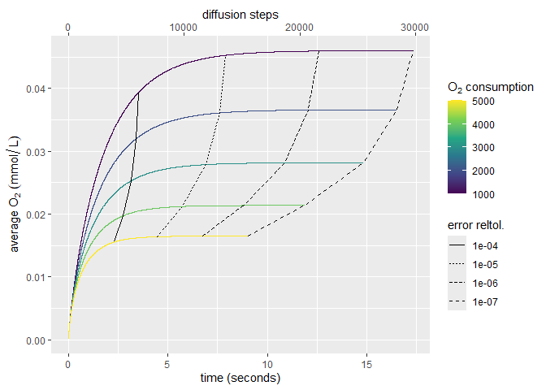

test_diffusion
================
Richard J Beck
2024-10-17

This example demonstrates setup and run for a sweep where
normal_oxygen_consumption_rate is varied and we examine how many
diffusion timesteps are required for the ABM to achieve steady state.

The config file is formatted as follows:

Required arguments:

path2BaseParFile: path to base parameter file. Include all parameters
you want to remain the same for each simulation in the sweep.

path2Output: output directory where sim will be saved. If the directory
doesn’t yet exist, it will be created.

javaCMD: command line instruction that you would issue on your system to
run the ABM jar file. The command will be issued from the same directory
as runSweep.R is called

sweeptype: don’t change this for now.

Optional arguments:

Include the names of any parameters you would like to be swept. Two
formats are accepted. THe following two statements are equivalent:

normal_oxygen_consumption_rate=1000:5000:1000

normal_oxygen_consumption_rate=1000,2000,3000,4000,5000

Edit the config file so that the paths correspond to the those on your
machine. From the command line run:

    Rscript .\scripts\runSweep.R .\examples\test_diffusion\config.txt

After the sweep has finished running, we can analyze the results.

First load the oxygen data generated by the ABM:

``` r
path2sweepdata <- "output/test_diffusion/data/"
runs <- list.files(path2sweepdata)

df <- do.call(rbind,lapply(runs,function(r){
  par <- readLines(paste0(path2sweepdata,r,"/params.txt"))
  i <- grepl("normal_oxygen_consumption_rate",par)
  par <- par[i]
  par <- unlist(strsplit(par,split=" "))
  
  o2 <- read.csv(paste0(path2sweepdata,r,"/oxygen.csv"))
  o2$parval <- as.numeric(par[2])
  colnames(o2)[colnames(o2)=="parval"] <- par[1]
  o2[!is.na(o2$O2),]
}))

df <- df[df$time<1,]
summary(df)
```

    ##       time                 O2               maxDelta       
    ##  Min.   :0.0000005   Min.   :0.0000714   Min.   :0.000000  
    ##  1st Qu.:0.0004660   1st Qu.:0.0032072   1st Qu.:0.000002  
    ##  Median :0.0010160   Median :0.0047713   Median :0.000023  
    ##  Mean   :0.0014994   Mean   :0.0064349   Mean   :     Inf  
    ##  3rd Qu.:0.0023331   3rd Qu.:0.0102185   3rd Qu.:0.000413  
    ##  Max.   :0.0046620   Max.   :0.0102510   Max.   :     Inf  
    ##                                          NA's   :5         
    ##  normal_oxygen_consumption_rate
    ##  Min.   :100.0                 
    ##  1st Qu.:100.0                 
    ##  Median :100.0                 
    ##  Mean   :204.8                 
    ##  3rd Qu.:300.0                 
    ##  Max.   :500.0                 
    ## 

Plot the maximum delta in the oxygen field for each value of the swept
parameter:

``` r
library(ggplot2)

sps <- 1/(diff(df$time[1:2])*(24*60^2)) ## seconds per timestep
p <- ggplot(df,aes(x=time*(24*60^2),y=maxDelta))+
  geom_line(aes(color=normal_oxygen_consumption_rate,
                group=normal_oxygen_consumption_rate))+
 
  scale_color_viridis_c(expression(O[2]~consumption))+
  scale_x_continuous("time (seconds)",
                     sec.axis = sec_axis(~.*sps,name="diffusion steps"))+
  scale_y_log10("max delta")
p
```

    ## Warning: Removed 5 rows containing missing values or values outside the scale range
    ## (`geom_line()`).

<!-- --> Plot the
average oxygen concentration at each grid site:

``` r
get_dtol_pts <- function(x,tol){
  x <- x[x$maxDelta<tol,]
  x <- split(x,f=x$normal_oxygen_consumption_rate)
  x <- do.call(rbind,lapply(x,head,1))
  x$tol <- tol
  x
}

x <- rbind(get_dtol_pts(df,0.0001),
           get_dtol_pts(df,0.00001),
           get_dtol_pts(df,0.000001),
           get_dtol_pts(df,0.0000001))

sps <- 1/(diff(df$time[1:2])*(24*60^2))

p <- ggplot(df,aes(x=time*(24*60^2),y=O2))+
  geom_line(aes(color=normal_oxygen_consumption_rate,
                group=normal_oxygen_consumption_rate))+
  geom_line(data=x,aes(linetype =as.character(tol)))+
  scale_linetype_discrete("error reltol.")+
  scale_color_viridis_c(expression(O[2]~consumption))+
  scale_x_continuous("time (seconds)",
                     sec.axis = sec_axis(~.*sps,name="diffusion steps"))+
  scale_y_continuous(expression(average~O[2]~(mmol/L)))
p
```

<!-- -->
